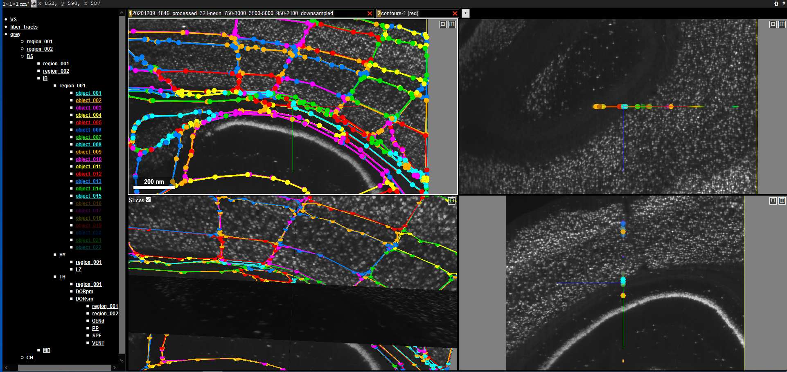

# NeuroTrALE (Neuron Tracing and Active Learning Environment) 

NeuroTrALE is a scalable active learning pipeline prototype for large-scale brain mapping that leverages high performance computing power. It enables high-throughput evaluation of algorithm results, which, after human review, are used for iterative machine learning model training.

NeuroTrALE is a derivative work building upon Google's open-source [Neuroglancer project](https://github.com/google/neuroglancer). Neuroglancer is a WebGL-based viewer for volumetric data. It is capable of displaying arbitrary (non axis-aligned) cross-sectional views of volumetric data, as well as 3-D meshes and line-segment based models (skeletons). NeuroTrALE adds features for creating polygon, point-wise, and linestring annotations, and editing algorithm-generated segmentations.

To satisfy the redistribution requirements of the original, APACHE 2.0-licensed Neuroglancer Project, a copy of the source LICENSE file (NeuroglancerLicenseCopy) is included in this repository. In addition, prominent changes and copyright notices have been added to a NOTICES file clearly indicating the files authored by MIT and those modified to support integration of the new functionality.

NeuroTrALE also leverages [Precomputed-tif](https://github.com/chunglabmit/precomputed-tif), a precomputed data source of TIF files along with a simple HTTP server of those files, developed by the Chung Lab at MIT.

# Key functionality

NeuroTrALE has been modified and extended in order to ingest, serve, and visualize raw images and algorithm results, as well as save any changes made by users for iterative machine learning model training. Specifically, we added the following capabilities to our web-based tool. These capabilities are typically only available in a desktop-based software:

- Ingest raw image volumes and algorithm outputs, including neuron/glia/centroid/axon detections
- Enhance visualization of algorithm detections overlaid on the raw imagery (along with existing visualization of imagery)
- Editing tools for polygons, points, and linestring annotation types
- Automatic saving of updated annotation data after human review
- Provide data scalability by breaking up annotation data into blocks and while keeping imagery intact
- Support JSON, CSV, and HDF5 formats
- Support serving multiple annotated datasets at once

NeuroTrALE augments the concept of layers in Neuroglancer to display brain microscopy image data from multiple channels (e.g., images from multiple fluorescent stains) and algorithm results in layers, which can be turned on and off dynamically by the user.

# Example applications

Hemisphere region editing and navigation:

Nuclei segmentation:

Axon tracing:

# Significance

Despite the success of new technologies, integrated reconstruction of the fine subcellular architectures, molecular details, and intercellular connectivity of diverse cell types in large-scale biological systems such as the human brain remains an unmet goal in biology. The top priority of the Brain Research through Advancing Innovative Neurotechnologies (BRAIN) Initiative sponsored by the National Institutes of Health (NIH) is to map the human brain at different scales with improved speed and accuracy. While deep learning-based approaches have shown effectiveness in neuron segmentation and tracing, one major challenge is the lack of annotated data, which often requires domain knowledge. The manual process is also laborious and time consuming. In addition, there is a lack of tools that allow domain experts to review the algorithm results at scale. In the scenarios where data may be abundant but labels are scarce or expensive to obtain, active learning is a viable solution and has been used in modern machine learning. Active learning is a special case of machine learning in which a learning algorithm can interactively cue a user to label new data points with the desired outputs. Active learning aims to achieve high accuracy using as few manually labeled instances as possible, thereby minimizing the cost of obtaining labeled data. 

# Background reading

- HPEC 2020 paper: <https://ieeexplore.ieee.org/document/9286225>
- ISBI 2021 paper: <https://ieeexplore.ieee.org/document/9434142>

# Supported data sources

Like Neuroglancer, NeuroTrALE depends on data being accessible via HTTP in a suitable format.  It is designed to easily support many different data sources, and there is existing support for the following data APIs/formats:

- BOSS <https://bossdb.org/>
- DVID <https://github.com/janelia-flyem/dvid>
- Render <https://github.com/saalfeldlab/render>
- [Precomputed chunk/mesh fragments exposed over HTTP](src/neuroglancer/datasource/precomputed)
- Single NIfTI files <https://www.nitrc.org/projects/nifti>
- [Python in-memory volumes](python/README.md) (with automatic mesh generation)
- N5 <https://github.com/saalfeldlab/n5>

# Supported browsers

- Chrome >= 51
- Firefox >= 46

# Keyboard and mouse bindings

For the complete set of bindings, see
[src/neuroglancer/ui/default_input_event_bindings.ts](src/neuroglancer/default_input_event_bindings.ts),
or within NeuroTrALE, press `h` or click on the button labeled `?` in the upper right corner.

- Click on a layer name to toggle its visibility.

- Double-click on a layer name to edit its properties.

- Hover over a segmentation layer name to see the current list of objects shown and to access the opacity sliders.

- Hover over an image layer name to access the opacity slider and the text editor for modifying the [rendering code](src/neuroglancer/sliceview/image_layer_rendering.md).
  
# Troubleshooting

- NeuroTrALE doesn't appear to load properly.

  NeuroTrALE requires WebGL (2.0) and the `EXT_color_buffer_float` extension.
  
  To troubleshoot, check the developer console, which is accessed by the keyboard shortcut `control-shift-i` in Firefox and Chrome.  If there is a message regarding failure to initialize WebGL, you can take the following steps:
  
  - Chrome
  
    Check `chrome://gpu` to see if your GPU is blacklisted.  There may be a flag you can enable to make it work.
    
  - Firefox

    Check `about:support`.  There may be webgl-related properties in `about:config` that you can change to make it work.  Possible settings:
    - `webgl.disable-fail-if-major-performance-caveat = true`
    - `webgl.force-enabled = true`
    - `webgl.msaa-force = true`
    
- Failure to access a data source.

  As a security measure, browsers will in many prevent a webpage from accessing the true error code associated with a failed HTTP request.  It is therefore often necessary to check the developer tools to see the true cause of any HTTP request error.

  There are several likely causes:
  
  - [Cross-origin resource sharing (CORS)](https://en.wikipedia.org/wiki/Cross-origin_resource_sharing)
  
    Like Neuroglancer, NeuroTrALE relies on cross-origin requests to retrieve data from third-party servers.  As a security measure, if an appropriate `Access-Control-Allow-Origin` response header is not sent by the server, browsers prevent webpages from accessing any information about the response from a cross-origin request.  In order to make the data accessible to NeuroTrALE, you may need to change the cross-origin request sharing (CORS) configuration of the HTTP server.
  
  - Accessing an `http://` resource from a NeuroTrALE client hosted at an `https://` URL
    
    As a security measure, recent versions of Chrome and Firefox prohibit webpages hosted at `https://` URLs from issuing requests to `http://` URLs.  As a workaround, you can use a NeuroTrALE client hosted at a `http://` URL, or one running on localhost.  Alternatively, you can start Chrome with the `--disable-web-security` flag, but that should be done only with extreme caution.  (Make sure to use a separate profile, and do not access any untrusted webpages when running with that flag enabled.)
    
# Multi-threaded architecture

In order to maintain a responsive UI and data display even during rapid navigation, work is split between the main UI thread (referred to as the "frontend") and a separate WebWorker thread (referred to as the "backend").  This introduces some complexity due to the fact that current browsers:
 - do not support any form of *shared* memory or standard synchronization mechanism (although they do support relatively efficient *transfers* of typed arrays between threads);
 - require that all manipulation of the DOM and the WebGL context happens on the main UI thread.

The "frontend" UI thread handles user actions and rendering, while the "backend" WebWorker thread handle all queuing, downloading, and preprocessing of data needed for rendering.

# Documentation Index

- [Image Layer Rendering](src/neuroglancer/sliceview/image_layer_rendering.md)
- [Cross-sectional view implementation architecture](src/neuroglancer/sliceview/README.md)
- [Compressed segmentation format](src/neuroglancer/sliceview/compressed_segmentation/README.md)
- [Data chunk management](src/neuroglancer/chunk_manager/)
- [On-GPU hashing](src/neuroglancer/gpu_hash/)

# Building

node.js is required to build the viewer.

1. First install NVM (node version manager) per the instructions here:

  https://github.com/creationix/nvm

2. Install a recent version of Node.js if you haven't already done so:

    `nvm install stable`
    
3. Install the dependencies required by this project:

   (From within this directory)

   `npm i`

   Also re-run this any time the dependencies listed in [package.json](package.json) may have
   changed, such as after checking out a different revision or pulling changes.

4. To run a local server for development purposes:

   `npm run dev-server`
  
   This will start a server on <http://localhost:8080>.
   
5. To run the unit test suite on Chrome:
   
   `npm test`

6. See [package.json](package.json) for other commands available.

# Disclaimer

DISTRIBUTION STATEMENT A. Approved for public release: distribution unlimited.
This material is based upon work supported by the Defense Advanced Research Projects Agency and MIT under Air Force Contract No. FA8702-15-D-0001. Any opinions, findings, conclusions or recommendations expressed in this material are those of the author(s) and do not necessarily reflect the views of the Defense Advanced Research Projects Agency and MIT.

Copyright (C) 2024, MASSACHUSETTS INSTITUTE OF TECHNOLOGY
    Subject to FAR 52.227-11 – Patent Rights – Ownership by the Contractor (May 2014)
    SPDX-License-Identifier: BSD-2-Clause

The software/firmware is provided to you on an As-Is basis