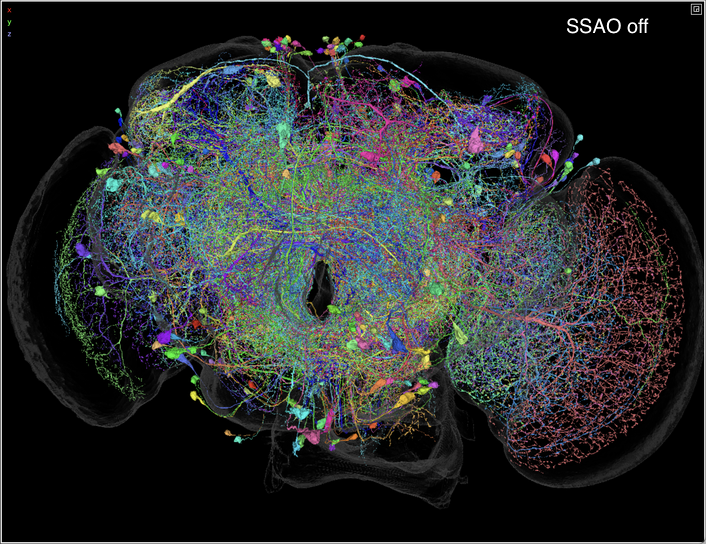
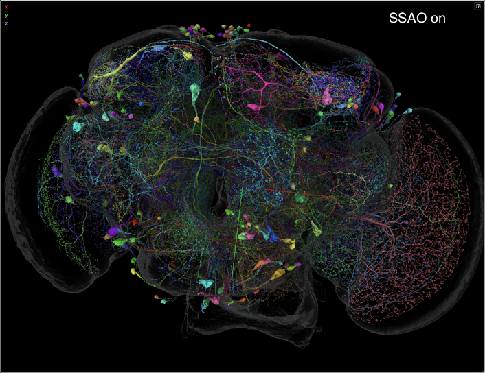

# Screen-Space Ambient Occlusion (SSAO)

SSAO simulates shadows on 3D mesh surfaces by darkening crevices and concavities
where ambient light would be occluded. It adds depth cues that help us perceive
shapes, and it makes the display more appealing. SSAO is an efficient
post-processing effect applied to the perspective view after opaque geometry is
drawn.

  
  

## User experience

Use the `q` key to toggle SSAO on and off. The settings panel has three
controls for SSAO:

- "Enable SSAO (shadows)": the `q` toggle
- "SSAO intensity": a slider with higher values giving darker shadow effects
- "SSAO radius": a slider with higher values giving broader, softer shadows

SSAO applies only to mesh surfaces (`MeshLayer` or `MultiscaleMeshLayer`).
SSAO does not apply to other opaque geometry like skeletons and annotations.
SSAO is disabled in any perspective view that contains a volume-rendering
layer.

## Technical details

### Overview

This implementation uses the Ground Truth Ambient Occlusion (GTAO) algorithm
presented by Jimenez et al. at SIGGRAPH 2016
(https://www.activision.com/cdn/research/PracticalRealtimeStrategiesTRfinal.pdf).

The algorithm does the following for each pixel:

1. Reconstruct the view-space position from the depth buffer.
2. Read the view-space normal from the normal buffer.
3. March in 4 directions (`NUM_DIRECTIONS`) × 8 steps (`NUM_STEPS`) to find the
   maximum horizon angle in each direction.
4. Integrate occlusion from the horizon angles relative to the surface normal.

Then the raw ambient occlusion is bilaterally blurred (depth-aware, 5-tap
kernel, two passes) and composited with the color buffer using
`color.rgb * pow(ao, intensity)`.

## Scope

SSAO is limited to mesh surfaces because only `MeshLayer` and
`MultiscaleMeshLayer` supply a view-space normal via the three-argument
`emit(color, pickId, viewNormal)` form. All other opaque geometry (skeletons,
single-meshes, annotations) calls the two-argument `emit(color, pickId)` form,
which writes the zero sentinel `vec4(0)` to the NORMAL attachment. The GTAO
shader treats a zero-RGB normal as a no-AO sentinel, so those pixels render
at full brightness. Highlighted (hovered) mesh segments use the same
zero-RGB sentinel so they also render without darkening.

This limitation for annotations is enforced in the compositing stage, where the
shader skips the AO multiplication for any pixel whose NORMAL value is the
zero-RGB sentinel. The two-argument emit writes `vec4(0, 0, 0, 1)` to NORMAL;
alpha must be 1 here for the blend mode `(SRC_ALPHA, ONE_MINUS_SRC_ALPHA)` to
fully overwrite the underlying mesh normal with the sentinel. The sentinel
lands at every annotation pixel (including explicitly translucent pixels and
anti-aliased edges). A consequence is that translucent annotations also do not
receive darkening at the covered pixels, since the sentinel takes precedence
of the underlying mesh's normal. In practice, pixels affected this way should
be limited. A fix could be to apply AO to the COLOR buffer before annotations
render.

Ordinary translucent volume layers do not interact with SSAO because the SSAO
pass runs after opaque geometry but before OIT/transparency. Max-projection
volume layers do write to the Z buffer, though, and the combination of that
volume rendering and SSAO has not been validated.

## Integration points

- **`perspective_view/panel.ts`**: Selects the `perspectivePanelEmitWithNormals`
  emitter when SSAO is enabled, inserts the SSAO passes between opaque geometry
  and OIT/transparency, modifies the final composite.
- **`mesh/frontend.ts`**: `MeshShaderManager` adds `uViewNormalMatrix` uniform
  and `vViewNormal` varying, calls `emit(color, pickId, viewNormal)`.
- **`perspective_view/panel.ts` (`OffscreenTextures`)**: NORMAL = 3 added as
  4th color attachment (RGBA8).
- **Settings panel**: SSAO checkbox and intensity/radius sliders appear in the
  global Settings side panel via `ViewerSettingsPanel` in
  `ui/viewer_settings.ts`, backed by trackable properties on `Viewer`.

## Emitter variations

Layer fragment shaders emitting into the perspective panel call one of two
overloads via the `renderContext` emitter:

- `emit(color, pickId, viewNormal)` — opaque surfaces that should _receive_ AO.
  `viewNormal` is in view space (right-handed, camera looking down -Z), need not
  be unit length. Caller is responsible for the world→view normal transform.
- `emit(color, pickId)` — opaque skeletons, single-meshes, annotations, axis
  lines, etc. Internally writes the zero-RGB sentinel `(0, 0, 0)` to NORMAL
  with alpha = 1. The composite shader skips the AO multiply for those pixels.

Highlighted (hovered) mesh segments use the same zero-RGB sentinel
automatically via the `uHighlighted` uniform; layer code does not need a
special case for the hover path. The OIT emitter accepts the 3-arg signature for
source compatibility but discards the normal: transparent surfaces do not
contribute to opaque AO.
