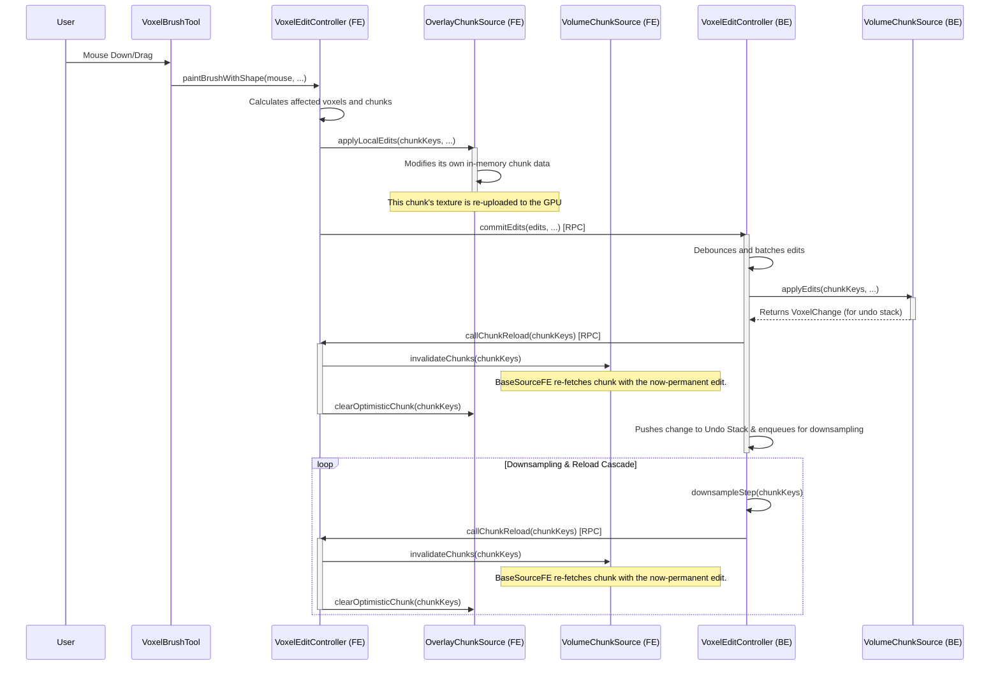

## TODOs

### priority
- url completion for the ssa+https source

- should we support compressed chunks? if yes, we should find a better way to handle them.

### later
- optimize flood fill tool (it is too slow on area containing uncached chunks, due to the getEnsuredValueAt() calls)
- the flood fill sometimes leaves artifacts in sharp areas (maybe increase fillBorderRegion() radius)
- write a testsuite for the downsampler and ensure its proper working on exotic lod levels

### questionable
- design a dataset creation feature
- adapt the brush size to the zoom level linearly

## Merging vox layer into seg and img layers

The proposed architecture integrates voxel editing directly into the existing Image and Segmentation layers by leveraging their inherent capabilities, rather than introducing a separate, simplified render layer. The core of the design is a new UserLayerWithVoxelEditingMixin which equips a host UserLayer with an editing controller and an associated in-memory VolumeChunkSource for optimistic previews. When a user paints, the edits are applied locally to this in-memory source. A second instance of the layer's primary, feature-rich RenderLayer class is then used to draw these edits as an overlay. This ensures the live preview is rendered with the exact same user-defined shaders and settings as the base data for perfect visual fidelity, while also elegantly handling the performance issue of editing compressed chunks by operating on an uncompressed in-memory source. This architecture reuses existing components, simplifies the overall codebase by eliminating the need for a separate VoxelAnnotationRenderLayer, and cleanly separates the concerns of displaying committed data versus previewing transient edits.

